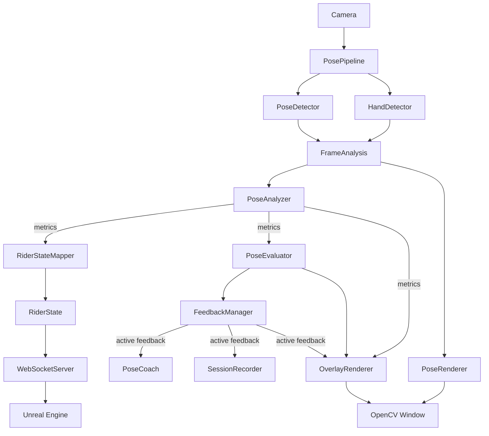
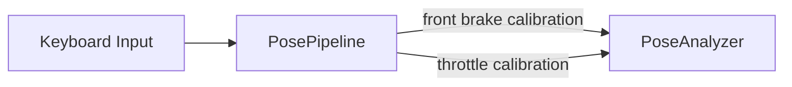

# Motorcycle Pose Simulator Architecture

## Overview

Motorcycle Pose Simulator is organized as a real-time processing pipeline.

`PosePipeline` is the central orchestrator. It coordinates camera input,
pose and hand detection, analysis, rider-state transport, feedback,
visualization, session recording, and calibration.

The architecture separates measurement from state, evaluation, feedback,
and presentation.

## Runtime Architecture



## Real-Time Processing

For every camera frame, `PosePipeline`:

1. reads a frame from `Camera`;
2. runs `PoseDetector`;
3. runs `HandDetector`;
4. combines the detection results into `FrameAnalysis`;
5. processes the frame when pose landmarks are available;
6. displays the rendered frame through OpenCV;
7. handles keyboard-based calibration commands.

`FrameAnalysis` provides a common input containing pose landmarks,
hand landmarks, and handedness information.

## Analysis

`PoseAnalyzer` receives `FrameAnalysis` and produces a set of metrics.

These metrics describe rider posture and motorcycle-control state.

The analysis layer contains specialized analysis responsibilities such as:

- arm and elbow posture;
- torso and head posture;
- leg and foot posture;
- rear-brake state;
- front-brake state;
- throttle state;
- clutch state.

Analysis does not depend on Unreal Engine.

## Rider State

Analysis metrics are converted by `RiderStateMapper` into a
transport-neutral `RiderState`.

```text
PoseAnalyzer
     |
   metrics
     |
     v
RiderStateMapper
     |
     v
 RiderState
     |
     v
WebSocketServer
     |
     v
Unreal Engine
```

This allows the analysis layer to remain independent from the
visualization or simulation client.

## Feedback

The same analysis metrics are also passed through the feedback path:

```text
PoseAnalyzer
     |
   metrics
     |
     v
PoseEvaluator
     |
     v
FeedbackManager
     |
 active feedback
    /       \
   v         v
PoseCoach  SessionRecorder
```

`PoseEvaluator` determines relevant pose feedback.

`FeedbackManager` manages the active feedback state.

`PoseCoach` controls how feedback is delivered to the rider.

The coach is designed to behave like a calm riding instructor rather
than an alarm system. Persistent conditions should not produce
unnecessary repetitive warnings.

## Visualization

Visualization is separate from analysis.

`PoseRenderer` draws detected pose landmarks onto the current frame.

`OverlayRenderer` displays analysis metrics, evaluation results, and
active feedback.

The resulting frame is displayed through the OpenCV window.

## Calibration

Calibration is a separate control path from normal frame processing.



Calibration commands use the latest valid analysis measurements and
update the corresponding analyzer calibration state.

## Session Processing

When the real-time session ends, `PosePipeline` completes the session
before releasing resources.

The session layer consists of:

```text
SessionRecorder
      |
      v
SessionSummary
      |
      v
SessionNarrator
      |
      v
OutputDispatcher
```

`SessionRecorder` collects relevant feedback during the ride.

`SessionSummary` converts recorded information into a session-level
summary.

`SessionNarrator` transforms the summary into human-friendly feedback
without changing the underlying facts.

`OutputDispatcher` sends the resulting output to configured output
implementations.

## Tracking Loss

Temporary landmark loss is treated as missing information, not
automatically as a change of rider state.

```text
valid measurement
       |
       v
 update state

missing measurement
       |
       v
 preserve state
```

Stateful motorcycle controls must therefore distinguish between:

- a measured state change;
- an unavailable measurement.

For example, temporary loss of the right foot must not generate a false
rear-brake release.

When tracking is reacquired, unstable initial measurements may be
ignored before state updates resume.

## Design Principle

The main architectural separation is:

```text
measurement
    |
    v
state
    |
    v
evaluation
    |
    v
feedback
    |
    v
presentation
```

This separation keeps tracking, control-state estimation, coaching,
session analysis, transport, and visualization independently
evolvable.